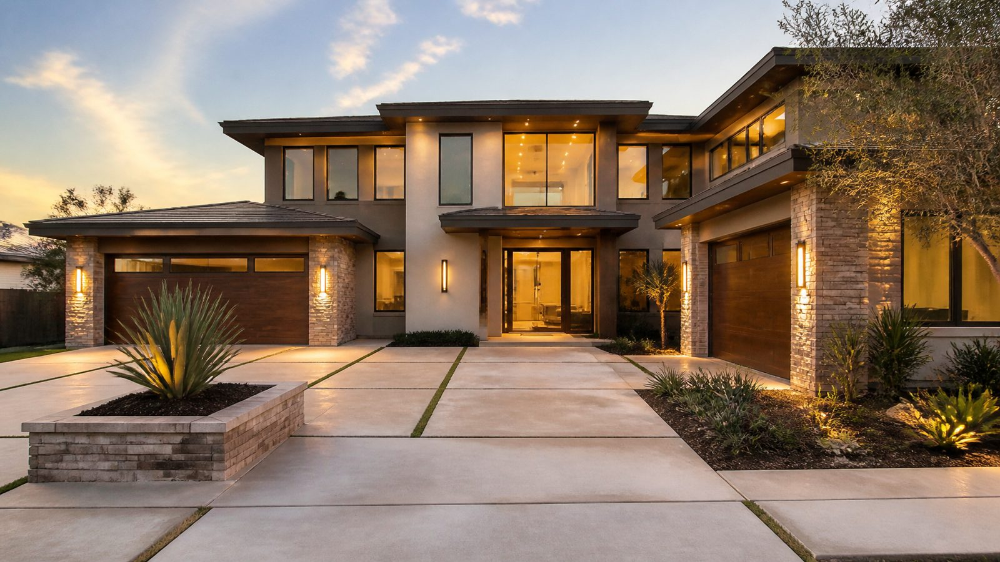

<div align="center">

# Homestead

**给本地小生意的专业网站 —— 几分钟部署,用聊天管理。**

选一个行业,指向一个域名,把 Telegram 机器人交给店主。产品就这么简单。

[English](README.md) · [部署(AI agent)](AGENT-DEPLOY.md) · [能力总表](docs/REFERENCE.zh.md) · [开发者文档](docs/DEVELOPMENT.md) · [许可证:AGPL-3.0](LICENSE)

</div>

---

## 这是什么

Homestead 是一套全栈建站框架(**Next.js + Flask + PostgreSQL**),从设计之初就为了**批量生产、手机端管理**。它是"用聊天操作的 Elementor"——每个页面都是设计 **token + 可组合区块**,零硬编码 CSS;所有操作(设计、内容、翻译、媒体、在线客服接管)都能通过 API 或 **Telegram 机器人**完成。没有后台面板,没有页面搭建器,不用写代码。

它的存在只为让一个商业模式变得便宜且可复制:**以约 $100 的价格把一个真实、专业的网站卖给本地小生意**,然后以接近零的边际成本交付和维护。三个核心优势让这件事成立:

| 优势 | Homestead 怎么实现 |
|---|---|
| **1. 批量化生产** | 一条命令部署一个完全独立的实例(自己的数据库、域名、内容)。`docker compose` + `ops/agent/deploy.sh` + 通过 API 建 Cloudflare 隧道。一台主机可并存多个客户站——见 [`docs/multi-instance.md`](docs/multi-instance.md)。 |
| **2. 行业深度适配** | 十几个**完整、带配图的行业模板**(每个 9 区块 + 声明好的配图)。一次调用 `POST /api/admin/site/rebrand` 就把整站换成新行业,再用 `GET /api/admin/consistency` 机器校验没有半成品残留。 |
| **3. AI 驱动的手机端管理** | 店主(或你代管)用大白话**给 Telegram 机器人发消息**就能改整站——"把我的网站改成除虫公司"、"把这张照片放首页"、"整站翻译成中文"、"有客人问价,替我回一下"。改错了一句话撤销。这是 Wix 和 WordPress 给不了的。 |

一切都跑在**你自己的**服务器和域名上。内容和客户资源都属于客户。

---

## 行业模板

十几个行业以**完整、带配图的首页**形式开箱即用——全幅大图 hero → 服务 → 作品集 → 流程 → 价格 → FAQ → CTA,每个图槽都预先标注,所以还没上传照片时页面就已经像成品。一次 `rebrand` 调用即可切换;新增一个行业只需加一条 spec。

| | | |
|---|---|---|
| **家政 / 上门服务** `construction` <br/> _压力清洗 · 水管 · 电工 · HVAC · 园艺 · 屋顶 · 除虫 · 清运…_ | **美容 / 水疗** `beauty` <br/>  | **餐厅 / 咖啡** `restaurant` <br/>  |
| **医疗 / 诊所** `healthcare` <br/>  | **律所 / 顾问** `legal` <br/>  | **健身房** `fitness` <br/>  |
| **房地产** `realestate` <br/>  | **创意 / 代理** `creative` <br/>  | **科技 / SaaS** `tech` <br/>  |
| **教育 / 辅导** `education` <br/>  | **金融 / 顾问** `finance` <br/>  | **公益** `nonprofit` <br/>  |

另有纯配色预设(`minimal`、`bold-dark`、`editorial`、`corporate`、`luxe`、`neon`、`playful` 等),可在任意结构上套一层独特外观——**共 19 套风格预设**。完整目录(字体 · 主题 · 15 种区块 · 技能↔API):[`docs/REFERENCE.zh.md`](docs/REFERENCE.zh.md)。

> **在线试穿:** 开启 `SITE_DEMO_PREVIEW=true` 后,访客可以在聊天窗里把整站实时预览成任意行业——一个自助式的活模板画廊。

---

## 内置 SEO / GEO / AEO

本地生意要同时被 Google **和** AI 问答引擎找到。每个 Homestead 站都自带同行通常跳过的技术层:

- **结构化数据(JSON-LD):** `LocalBusiness` + `Service` + `FAQPage` + `BreadcrumbList`,由站点真实的 NAP(名称、地址、电话、营业时间、服务城市)驱动。**不做** `AggregateRating`/`Review` 标记——Google 会取消自托管评价的星级富结果资格,所以刻意省略。
- **NAP 一致性**作为一等数据模型(`SiteSettings` + 每页 `local_business_overrides` 用于城市专属落地页)。
- **`sitemap.xml`** 覆盖所有页面、**`robots.txt`**、以及 **`/llms.txt`**。
- **服务端渲染 HTML**,让 AI 爬虫(GPTBot、ClaudeBot、PerplexityBot——都不执行 JavaScript)读到完整内容。

---

## 几分钟部署

你提供一台服务器、一个在 Cloudflare 上的域名、一个 Cloudflare API token,其余交给 agent。

```bash
git clone https://github.com/NextAgentBC/homestead-framework.git homestead && cd homestead

export SITE_DOMAIN=client.example.com API_DOMAIN=client-api.example.com \
       ADMIN_EMAIL=you@example.com CF_API_TOKEN=… CF_ACCOUNT_ID=…
export SITE_INDUSTRY=construction          # 上面任意行业 key
bash ops/agent/deploy.sh                    # 环境 → 构建 → 健康检查 → token → 隧道 → 验证
```

`deploy.sh` 幂等且自校验——报错修好后重跑即可。首次启动时站点已经是选定行业的完整多页 demo。之后用聊天或 API 定制,再把机器人交给店主。

- **完整无头部署 runbook(给 AI agent):** [`AGENT-DEPLOY.md`](AGENT-DEPLOY.md)
- **把已部署的站变成客户的:** [`docs/getting-started.zh.md`](docs/getting-started.zh.md)——换行业 → 换图 → 改文案 → 双语 → 一致性验收
- **一台主机多个客户:** [`docs/multi-instance.md`](docs/multi-instance.md)
- **更新已上线的站:** `bash ops/agent/update.sh`

---

## 用手机管理

部署后,站点由一个暴露为 **Telegram 机器人**的 OpenClaw agent 驱动。店主(或运营者)可以真实地发这些消息:

> "把我的网站改成一家叫 Rapid Rooter 的水管公司" → 整站换肤,品牌+文案更新
> "把这张照片放首页" _(附一张图)_ → 秒级上传并生效
> "写一篇关于春季清理排水沟的博客" · "把网站翻译成中文" · "撤销刚才那个改动"
> _(访客在网站上提问)_ → 镜像到你的 Telegram;回一句就接管对话

每种区块还有自己的轻量技能(`加个 FAQ`、`加个价格表`……),最终都路由到编排引擎。聊天大脑是**沙箱、无工具**的——它碰不到服务器,只能改公开站点的内容。

技能↔API 对照:[`skills/README.md`](skills/README.md) · [`docs/REFERENCE.zh.md`](docs/REFERENCE.zh.md)。

---

## 技术底层

- **前端** —— Next.js App Router,服务端渲染,token 驱动主题(不硬编码行业样式)。
- **后端** —— Flask + SQLAlchemy + PostgreSQL;小而稳、有文档的 API(`backend/app/openapi.json`)。
- **内容模型** —— 页面和首页都是有序的**区块**列表(15 种);设计存在独立的 token 档里,结构与外观解耦。
- **运维** —— `docker-compose`(已参数化支持多实例)、通过 API 建 Cloudflare 隧道、自托管媒体、每日 AI 博客自动化。

架构、本地开发、环境变量、API 契约和维护说明都在 [`docs/DEVELOPMENT.md`](docs/DEVELOPMENT.md)。

---

## 许可证

[AGPL-3.0](LICENSE)。你可以为客户部署 Homestead 并收费。如果你把它作为托管服务提供给他人,许可证要求你以相同条款公开你的修改。

<sub>内部标识符(仓库目录、服务、`homestead-site` 数据库、`homestead-site-*` 技能)保留原始的 `homestead-site` 代号;只有产品名是 Homestead。</sub>
